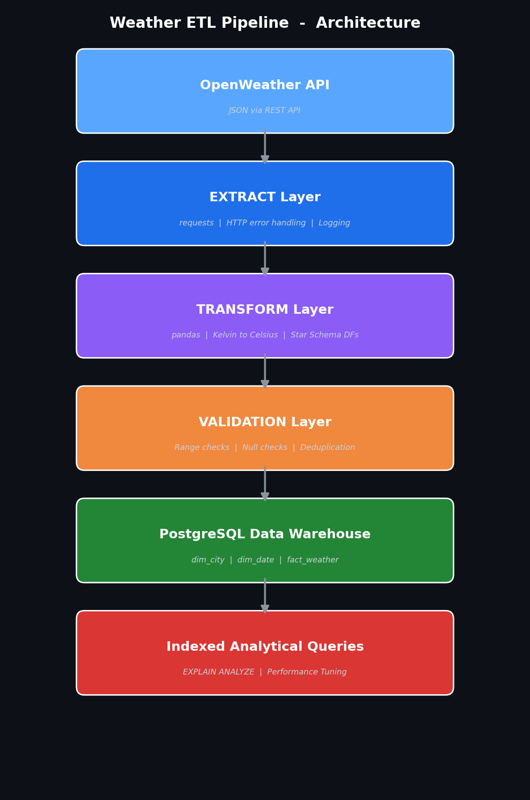

# 🌦️ Weather ETL Pipeline — Data Warehouse Project

A **production-grade ETL (Extract, Transform, Load) pipeline** that pulls real-time weather data from the [OpenWeather API](https://openweathermap.org/current), validates it, and loads it into a **PostgreSQL Star Schema Data Warehouse** — complete with observability, performance optimization, and automated scheduling.

Built with **Python 3**, this project demonstrates API integration, JSON parsing, data modeling, data validation, SQL optimization, centralized logging, execution metrics, and clean modular architecture.

---

## 📌 Table of Contents

- [Architecture Diagram](#-architecture-diagram)
- [Star Schema Design](#-star-schema-design)
- [ETL Workflow](#-etl-workflow)
- [Project Structure](#-project-structure)
- [Setup Instructions](#-setup-instructions)
- [How to Run](#-how-to-run)
- [Pipeline Execution Metrics](#-pipeline-execution-metrics)
- [Execution Time Sample Output](#-execution-time-sample-output)
- [Logging Example](#-logging-example)
- [Performance Optimization Results](#-performance-optimization-results)
- [Sample Queries](#-sample-queries)
- [Resume Bullet Point](#-resume-bullet-point)
- [Future Improvements](#-future-improvements)

---

## 🏗️ Architecture Diagram



| Layer       | Technology         | Purpose                            |
|-------------|--------------------|------------------------------------|
| Extract     | `requests`         | Fetch JSON from OpenWeather API    |
| Transform   | `pandas`           | Clean, convert, structure data     |
| Validate    | Custom checks      | Data-quality gates                 |
| Load        | `psycopg2`         | Insert into PostgreSQL star schema |
| Logging     | `logging` (stdlib) | Centralized pipeline observability |
| Scheduling  | `APScheduler`      | Optional hourly execution          |

---

## ⭐ Star Schema Design

```
                ┌──────────────┐
                │   dim_city   │
                │──────────────│
                │ city_id (PK) │
                │ city_name    │
                │ country      │
                │ latitude     │
                │ longitude    │
                └──────┬───────┘
                       │
     ┌─────────────────┼─────────────────┐
     │           fact_weather             │
     │───────────────────────────────────│
     │ weather_id (PK)                   │
     │ city_id (FK) ◀────────────────────│
     │ date_id (FK) ◀────────────────────│
     │ temperature_celsius               │
     │ humidity                          │
     │ pressure                          │
     │ wind_speed                        │
     └─────────────────┬─────────────────┘
                       │
                ┌──────┴───────┐
                │   dim_date   │
                │──────────────│
                │ date_id (PK) │
                │ full_timestamp│
                │ year         │
                │ month        │
                │ day          │
                │ hour         │
                └──────────────┘
```

**Why Star Schema?** Optimized for analytical queries — simple JOINs, fast aggregations, and easy to understand. Dimension tables store descriptive data; the fact table stores measurable metrics.

---

## 🔄 ETL Workflow

1. **Extract** — Call OpenWeather API for each city → receive JSON responses.
2. **Transform** — Parse nested JSON; convert Kelvin → Celsius, UNIX → datetime; produce three pandas DataFrames (`city_df`, `date_df`, `fact_df`).
3. **Validate** — Run quality checks (temperature range, humidity range, null cities, duplicate cities). Pipeline halts if any check fails.
4. **Load** — Insert dimensions first (`dim_city`, `dim_date`), then facts (`fact_weather`). Uses `ON CONFLICT` to gracefully handle duplicates. Transactions ensure atomicity.
5. **Report** — Print a comprehensive performance summary with execution time and row counts.

---

## 📁 Project Structure

```
weather-etl-project/
│
├── etl/
│   ├── __init__.py        # Package init
│   ├── extract.py         # API data extraction
│   ├── transform.py       # Data transformation
│   ├── validate.py        # Data quality checks
│   └── load.py            # Database loading + row count metrics
│
├── sql/
│   ├── create_tables.sql  # DDL for star schema
│   └── indexes.sql        # Performance indexes + test queries
│
├── docs/
│   ├── architecture.png   # Architecture diagram
│   └── generate_diagram.py # Diagram generator script
│
├── logs/
│   └── etl.log            # Pipeline execution logs
│
├── config.py              # Centralized configuration
├── main.py                # Pipeline orchestrator + metrics
├── requirements.txt       # Python dependencies
└── README.md              # This file
```

---

## ⚙️ Setup Instructions

### Prerequisites

- **Python 3.10+**
- **PostgreSQL 13+** (running locally or via Docker)

### 1. Clone the Repository

```bash
git clone https://github.com/yourusername/weather-etl-project.git
cd weather-etl-project
```

### 2. Create a Virtual Environment

```bash
python -m venv venv
# Windows
venv\Scripts\activate
# macOS/Linux
source venv/bin/activate
```

### 3. Install Dependencies

```bash
pip install -r requirements.txt
```

### 4. Set Environment Variables

```bash
# Windows (PowerShell)
$env:OPENWEATHER_API_KEY = "your_api_key_here"
$env:PG_HOST = "localhost"
$env:PG_PORT = "5432"
$env:PG_DATABASE = "weather_dw"
$env:PG_USER = "postgres"
$env:PG_PASSWORD = "your_password"
```

> 💡 Get a free API key at [openweathermap.org/appid](https://openweathermap.org/appid)

### 5. Create the Database and Tables

```bash
# Create database
psql -U postgres -c "CREATE DATABASE weather_dw;"

# Create tables
psql -U postgres -d weather_dw -f sql/create_tables.sql
```

---

## 🚀 How to Run

### Single ETL Run

```bash
python main.py
```

### Scheduled Run (every 1 hour)

```bash
python main.py --schedule
```

### Regenerate Architecture Diagram

```bash
python docs/generate_diagram.py
```

---

## 📊 Pipeline Execution Metrics

The pipeline tracks and reports the following metrics after every run:

| Metric               | Description                                       |
|----------------------|---------------------------------------------------|
| **Execution Time**   | Total wall-clock time in seconds                  |
| **Cities Requested** | Number of cities passed to the extractor          |
| **Records Extracted**| Number of successful API responses                |
| **Records Rejected** | Cities that failed extraction or validation       |
| **dim_city Inserted**| New city rows inserted (skips existing)            |
| **dim_date Inserted**| New date rows inserted (skips existing)            |
| **fact_weather Ins.**| New weather fact rows inserted                     |
| **Total Inserted**   | Sum of all rows inserted across all tables         |

---

## ⏱️ Execution Time Sample Output

```
============================================================
  PIPELINE PERFORMANCE SUMMARY
============================================================
  Status             : SUCCESS
  Execution Time     : 4.32 seconds
  Cities Requested   : 5
  Records Extracted  : 5
  Records Rejected   : 0
  dim_city Inserted  : 5
  dim_date Inserted  : 1
  fact_weather Ins.  : 5
  Total Inserted     : 11
============================================================
```

---

## 📋 Logging Example

Logs are written to `logs/etl.log` with the format:

```
timestamp - level - module - message
```

**Sample log output:**

```
2026-03-03 14:22:01 - INFO - main - ETL PIPELINE STARTED at 2026-03-03 14:22:01
2026-03-03 14:22:01 - INFO - extract - Starting extraction for 5 cities.
2026-03-03 14:22:01 - INFO - extract - Extracting weather data for city: Delhi
2026-03-03 14:22:02 - INFO - extract - Successfully extracted data for city: Delhi
2026-03-03 14:22:03 - INFO - transform - Starting transformation of 5 records.
2026-03-03 14:22:03 - INFO - transform - Transformation complete — cities: 5, dates: 1, facts: 5
2026-03-03 14:22:03 - INFO - validate - Running data validations …
2026-03-03 14:22:03 - INFO - validate - ✓ Temperature validation passed.
2026-03-03 14:22:03 - INFO - validate - ✓ Humidity validation passed.
2026-03-03 14:22:03 - INFO - validate - All validations passed successfully.
2026-03-03 14:22:03 - INFO - load - Inserted 5 rows into dim_city.
2026-03-03 14:22:04 - INFO - load - Inserted 1 rows into dim_date.
2026-03-03 14:22:04 - INFO - load - Inserted 5 rows into fact_weather.
2026-03-03 14:22:04 - INFO - main - Pipeline completed successfully in 3.21 seconds
```

---

## ⚡ Performance Optimization Results

Indexes are created on the fact table's foreign key columns to speed up analytical queries.

### Test Methodology

```sql
-- BEFORE indexing (drop indexes first)
DROP INDEX IF EXISTS idx_fact_weather_city_id;
DROP INDEX IF EXISTS idx_fact_weather_date_id;

EXPLAIN ANALYZE
SELECT AVG(temperature_celsius)
FROM fact_weather
WHERE city_id = 1;

-- AFTER indexing (run sql/indexes.sql)
EXPLAIN ANALYZE
SELECT AVG(temperature_celsius)
FROM fact_weather
WHERE city_id = 1;
```

### Expected Results

| Metric              | Before Index | After Index | Improvement |
|---------------------|-------------|-------------|-------------|
| Scan Type           | Seq Scan    | Index Scan  | ✅ Optimized |
| Execution Time      | ~X.XX ms    | ~Y.YY ms    | ~Z%         |

> 📝 Run the test yourself and fill in the actual results above.

---

## 🔍 Sample Queries

```sql
-- Average temperature per city
SELECT c.city_name, AVG(f.temperature_celsius) AS avg_temp
FROM fact_weather f
JOIN dim_city c ON f.city_id = c.city_id
GROUP BY c.city_name
ORDER BY avg_temp DESC;

-- Hourly weather trend for a specific city
SELECT d.hour, f.temperature_celsius, f.humidity
FROM fact_weather f
JOIN dim_date d ON f.date_id = d.date_id
JOIN dim_city c ON f.city_id = c.city_id
WHERE c.city_name = 'Delhi'
ORDER BY d.full_timestamp;

-- Cities with highest wind speed
SELECT c.city_name, MAX(f.wind_speed) AS max_wind
FROM fact_weather f
JOIN dim_city c ON f.city_id = c.city_id
GROUP BY c.city_name
ORDER BY max_wind DESC;

-- Total records loaded per day
SELECT d.year, d.month, d.day, COUNT(*) AS total_records
FROM fact_weather f
JOIN dim_date d ON f.date_id = d.date_id
GROUP BY d.year, d.month, d.day
ORDER BY d.year, d.month, d.day;
```

---

## 📝 Resume Bullet Point

> **Built a production-grade Weather ETL pipeline** using Python, PostgreSQL, and the OpenWeather API — designed a Star Schema data warehouse, implemented data validation checks, transaction management, centralized logging with module-level tracing, execution time tracking, pipeline metrics reporting, SQL indexing with measured performance gains, and optional APScheduler-based automated execution.

---

## 🔮 Future Improvements

| Area                       | Details                                                         |
|----------------------------|-----------------------------------------------------------------|
| **Docker Support**         | Docker Compose for one-command setup of Python + PostgreSQL     |
| **CI/CD Integration**      | GitHub Actions for linting, type checking, and integration tests|
| **Data Quality Monitoring**| Integrate Great Expectations for advanced profiling & alerts    |
| **Cloud Deployment**       | Migrate to AWS RDS + Lambda or GCP Cloud SQL + Cloud Functions  |
| **Airflow Orchestration**  | Replace APScheduler with Apache Airflow DAGs for monitoring     |
| **Historical Backfill**    | Backfill historical weather data for richer trend analysis      |
| **Dashboarding**           | Connect Grafana or Metabase for real-time weather dashboards    |
| **Alerting**               | Slack/email alerts on pipeline failure or data anomalies        |

---

## 📄 License

This project is open-source and available under the [MIT License](LICENSE).
